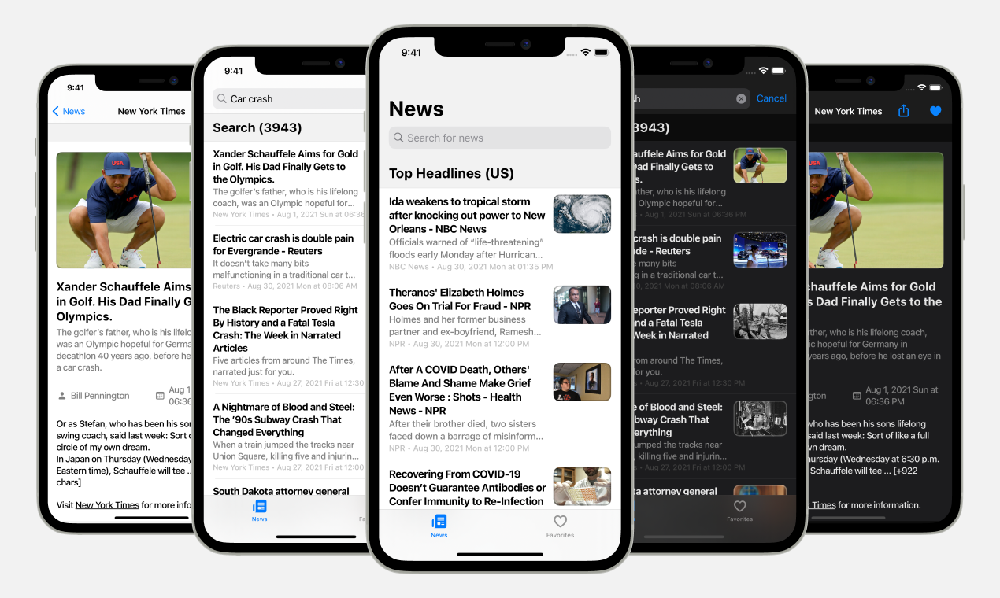

# Appcent Assignment App

> This project was made within "Appcent iOS Assignment".

⚠️ To access the API, get an API key **[here](https://newsapi.org)** and replace it with "API_KEY" in the project.

## Architecture

MVVM architecture was used in this project.

## Compatibility

Requires iOS 11.0 or later. Compatible with iPhone.

## API

- **[NewsAPI](https://newsapi.org)**

## Third Party Libraries

> Added via Swift Package Manager.

- **[Alamofire](https://github.com/Alamofire/Alamofire)**
- **[Nuke](https://github.com/kean/Nuke)**
- **[LBTATools](https://github.com/bhlvoong/LBTATools)**
